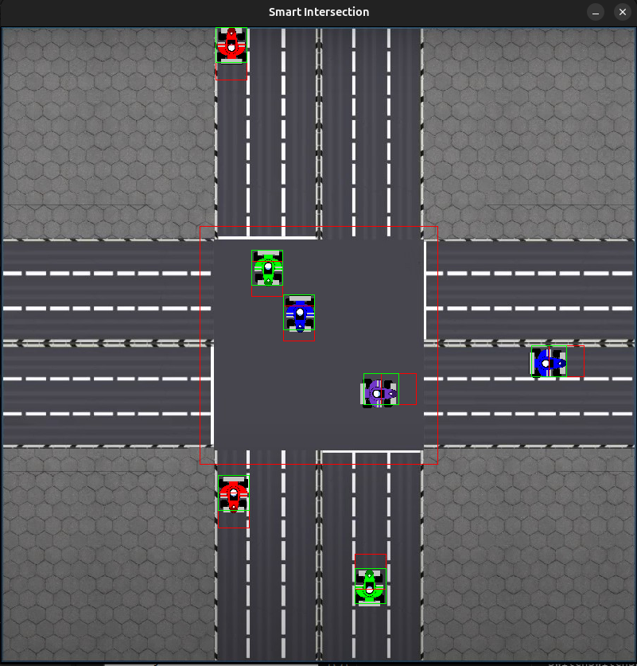

# Smart Road - An Autonomous Vehicules Trafic Simulation

## Introduction

This project simulates traffic movement at an intersection using Rust and SDL2. It features animated vehicles following predefined paths, collision detection mechanisms, and sprite-based rendering. The project serves as an example of Rust programming concepts alongside SDL2's powerful graphical capabilities.


## Features

- Vehicle Simulation:
    - Vehicles follow predefined paths based on starting position and intended direction.
    - Simulated speeds, angles, and collision boxes ensure realistic behavior.

- Pathfinding:
    - Paths are dynamically generated for vehicles to navigate intersections.

- Collision Detection:
    - Vehicles detect potential collisions and adjust speeds to maintain safe distances.

- Sprite Animation:
    - Vehicle sprites are rendered and animated using SDL2's texture-handling capabilities.


## Prerequisites - Setup - Execution

Before running the project, ensure the following are installed:

1. Rust and Cargo
- Install Rust

2. SDL2 Development Libraries
- Linux:
bash 
```
sudo apt-get install libsdl2-dev libsdl2-image-dev
```

- macOS:
bash
```
brew install sdl2 sdl2_image
```

- Windows:
    - Download SDL2 and SDL2_image libraries from the SDL2 website.

3. Clone the Repo and go to smart-road
bash
```
git clone https://github.com/your-repo-name/traffic_simulation.git
cd traffic_simulation
```

4. Build & Run 
bash
```
cargo build --realease
cargo run
```

## Roadmap

1.Rust Features

- Structs and Enums:

    - Defined Sprite, Path, and Vehicule structs for sprite handling, pathfinding, and vehicle simulation.
    - Used enums (Start, Direction) to categorize vehicle behaviors and origins.

- Ownership and Lifetimes:
    - Managed textures using lifetimes to ensure safety while loading and referencing resources.
    - Leveraged Option to handle cases where a texture might not be loaded.

- Error Handling:

    - Used Result and ? operator to handle potential errors during SDL operations.
2. SDL2 Functionalities
- Texture Loading:
    - Used TextureCreator and load_texture from sdl2::image to manage sprite resources.

- Animation:
    - Divided textures into frames using Rect for sprite animation.

- Rendering:
    - Scaled and rotated vehicle sprites using canvas.copy_ex.

3. Vehicle Behavior

- Pathfinding:
    - Implemented the Path struct to define checkpoints for vehicles.
    - Vehicles follow a sequence of Points and update their positions each frame.

- Collision Boxes:
    - Calculated dynamic collision boxes using the Rect struct.
    - Checked for intersections with other vehicles to prevent collisions.

- Dynamic Behavior:
    - Adjusted vehicle speed and angles dynamically based on their current position and target.


## Screenshots

<p align="center">
    
</p>

## Running Tests

1. Manual Vehicle Invocation
- Controls:
    - Press UP, DOWN, RIGHT, or LEFT to invoke a vehicle starting from the corresponding direction.
    - Each key simulates a new vehicle entering the intersection from its respective lane.
- Expected Outcome:
    - A vehicle should spawn at the specified direction and start navigating its pre-defined path.

2. Randomized Vehicle Spawning
- Action:
    - Press R to enable random vehicle spawning.
    - Vehicles will spawn at random intervals, with a default delay of 300 milliseconds between spawns.
- Expected Outcome:
    - Vehicles will appear from random directions at regular intervals.

3. Collision Visualization
- Details:
    - The intersection is visually marked to highlight the crossing area of the two main roads.
    - Each vehicle’s hitbox is visible as a rectangle, showing its active collision zone.
- Expected Behavior:
    - Vehicles dynamically adjust their speed or stop if their hitboxes intersect, avoiding collisions.
    - Hitboxes update in real-time as vehicles move and rotate.